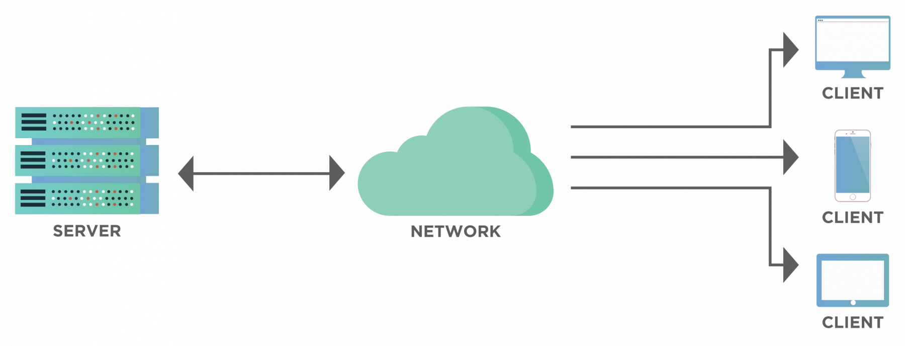

# Implementing a Client-Server Architecture using MySQL Database Management System (DBMS)
___
## Understanding Client-Server Architecture

Client-Server refers to an architecture in which two or more computers are connected together over a network to send and receive requests from one another. In their communication, each machine has its role: the machine sending requests is usually referred to as a **Client** and the machine responding is called a **Server**.

Clients and servers work together in a Client-Server Architecture to enable communication, data exchange and the provision of services over a network. This interaction is a fundamental concept in modern computing and is used in various applications, including web browsing, file sharing and database access. 

A simple diagram of a Web Client-Server Architecture is shown below:



Here's how clients and servers work together:

### 1. Client Request
* The client initiates communication by sending a request to the server. This request typically specifies what the client needs such as a web page, an email, a file or a database query.

* The request includes information like the type of service required, any parameters and other relevant data.

### 2. Server Response
* The server receives the client's request and processes it based on the service or resource requested.

* The server performs the necessary operations to generate a response, which could be data, content or an acknowledgment.

### 3. Data Transmission
* The server sends the response back to the client over the network.

* The client receives and processes the response. This may involve rendering a web page, displaying an email, saving a file or presenting data.

### 4. Interaction
* The client and server can engage in a back-and-forth interaction, with the client making additional requests and the server responding as needed.

* This interaction continues until the client's requirements are met or until the client chooses to terminate the connection.

### 5. Statelessness
* In many client-server interactions, the server is stateless, meaning it doesn't retain information about previous requests from the same client. Each request from the client is independent and the client must include any necessary context or session information.

* However, stateful communication is also possible, where the server maintains some level of session state between requests.

The diagram below shows a machine trying to access a website using a web browser or simply **curl** command as a client and it sends HTTP requests to a web server (Apache, Nginx, IIS or any other server) over the internet.


If we extend this concept further and add a Database Server to our architecture, we can get the picture shown below:


In this case, the Web Server has the role of the client that connects and reads/writes to/from a Database (DB) Server (MySQL, MongoDB, Oracle or SQL Server) and the communication happens over a Local Network (it can also be Internet Connection but it is a common practice to place the Web Server and Database Server close to each other in a local network).

The setup on the diagram above is a typical generic Web Stack architecture (LAMP, LEMP, MEAN, MERN). This technology can be implemented with many other technologies (i.e. various Web and Database Servers from Small Page Applications to Large and Complex Portals).


## How To Implement a Client-Server Architecture using MySQL Database Management System (DBMS)

### Prerequisite

1. Ensure you have an AWS account. If you don't have an account, [sign up for AWS here.](https://portal.aws.amazon.com/billing/signup#/start/email)

The following steps are taken to implement a basic Client-Server Architecture using MySQL Relational Database Management System (RDBMS):

### Step 1: Create and configure two Linux-Based Virtual Servers (EC2 Instance in AWS)

* On the EC2 Dashboard, click on the Launch Instance button.


* On the Name Box and Amazon Machine Image, type **mysql_server** and **ubuntu** respectively then select **2** as the number of Instances you want to create.


* Select **Ubuntu Server 22.04 LTS (HVM), SSD Volume Type** as the Amazon Machine Image.


* Click on create new key pair.


* Give the key pair name a name of your choice (i.e client-server-key), select `RSA` as the key pair type and `.pem` as the key file format then click on **Create key pair**.


* The key pair will be downloaded into the Downloads folder on your computer.

* Click on the Launch Instance button.


* On the EC2 Dashboard, click on the Instances tab to display all the Instances on your AWS console.


* You will notice there are 2 Instances named **mysql_server**, rename one of them to **mysql_client** by clicking on the pencil icon that appears right beside the name of the Instance.


* Click on the Instance ID of the **mysql_client** Instance and copy the **Private IPv4 address**.


### Step 2: Allow MySQL connection from the MySQL Client's IPv4 Address on the MySQL Server

* Click on the Instance ID of the **mysql_server** Instance.


* Click on the Security tab and then click on the Security group.


* Click on Edit Inbound Rules.


* Click on the Add Rule button.


* Select **MySQL/Aurora** as the connection type and paste the **MySQL-Client IPv4 address** you copied into the Custom IPv4 address box and click on the **save rules** button.


### Step 3: Install the MySQL-Server Software on the MySQL Server Linux Server

* Click on the Instance ID of the **mysql_server**.


* Click on the **Connect** button.


* Copy the highlighted commands shown below:


* Open your terminal.

* Go to the directory (i.e. /Downloads) where the `.pem` key pair is stored using the command shown below:

```bash
cd Downloads
```


* Paste the following command to give read permissions to the `.pem` key pair file:

```bash
sudo chmod 400 <private-key-pair-name>.pem
```


* SSH into the MySQL Server Instance using the command shown below:

```bash
ssh -i <private-key-name>.pem ubuntu@<Public-IP-address>
```


* Update the list of packages in the package manager.

```bash
sudo apt update
```


* Run the MySQL Server package installation.

```bash
sudo apt install mysql-server -y
```


In MySQL, the bind-address parameter in the `mysqld.cnf` file is used to specify the IP address on which the MySQL server should listen for incoming connections. Its default setting is `bind-address  = 127.0.0.1`.

To listen to all connections from all available network interfaces, the default bind-address parameter is changed to `0.0.0.0` (i.e. Default Gateway). 

However, it is best practice to set security precautions such as **Firewall Rules** and **MySQL User Privileges** to control incoming connections to the remote server. In our case, we set security precautions by configuring the **Inbound Rules** on the **MySQL TCP port** to only allow connections from the **MySQL Client Private IPv4 Address** on the **MySQL Server**.

* Run the following command to open the MySQL configuration file to change the **bind-address**.

```bash
sudo vi /etc/mysql/mysql.conf.d/mysqld.cnf 
```


* Log into the MySQL console by running the command shown below:

```bash
sudo mysql
```


* Run a security script that sets the password (i.e. **PassWord.1**) for the root user using the following command:

```bash
ALTER USER 'root'@'localhost' IDENTIFIED WITH mysql_native_password BY 'PassWord.1';
```


* Exit the MySQL console using the following command:

```bash
mysql > exit;
```


* Enable the MySQL service using the following command:

```bash
sudo systemctl enable mysql
```


* Run the following command to check if the MySQL service is running:

```bash
sudo systemctl status mysql
```


From the image above, it is evident that the MySQL service is running.

* Run the following command to start the interactive script to improve the security of the MySQL Server installation:

```bash
sudo mysql_secure_installation
```


The script will give the following prompts and your responses should be as follows:

1. Validate the password `y`.


2. Select the level of password validation policy that matches the password you set initially, in this case, **2** matches the password I chose hence enter `2`.


3. Change the root password `n`.


4. Remove anonymous users `n`.


5. Disallow root login remotely `n`.


6. Remove the test database and access to it `y`.


7. Reload privilege tables `y`.


* Log into the MySQL console with the following command:

```bash
sudo mysql -u root -p
```


* Run the following command to create a user named **donald** with the password `PassWord.1`:

```bash
CREATE USER 'donald'@'%' IDENTIFIED WITH mysql_native_password BY 'PassWord.1';
```


*Note that the `%` wildcard after the `@` sign is used to represent any host. This means the user "donald" is allowed to connect to the MySQL Server from any host.*

* Run the following command to create a database called **testing_123**:

```bash
CREATE DATABASE testing_123;
```


* Run the following command to grant all privileges to the user **donald**:

```bash
GRANT ALL PRIVILEGES ON *.* TO 'donald'@'%' WITH GRANT OPTION;
```


*Note that the `*.*` wildcard means all databases and tables. Hence, the command above gives the user **donald** administrative privileges on all databases and tables.*

* Run the following command to apply and make changes effective:

```bash
FLUSH PRIVILEGES;
```


* Exit the MySQL console.


* Restart the MySQL service using the command shown below:

```bash
sudo systemctl restart mysql
```


### Step 4: Install the MySQL-Client Software on the MySQL Client Linux Server

* Click on the Instance ID of the **mysql_client**.


* Click on the **Connect** button.


* Copy the highlighted command shown below:


* Open another terminal on your computer.

* Go to the directory (i.e. /Downloads) where the `.pem` key pair is stored using the command shown below:

```bash
cd Downloads
```


* SSH into the MySQL Client Instance using the command shown below:

```bash
ssh -i <private-key-name>.pem ubuntu@<Public-IP-address>
```


* Update the list of packages in the package manager.

```bash
sudo apt update
```


* Run the MySQL Client package installation.

```bash
sudo apt install mysql-client -y
```


### Step 5: Remotely connect to the MySQL Server from the MySQL Client

* On the terminal of the MySQL Server, run the following command to generate the **Private IP address** of the MySQL Server:

```bash
hostname -i
```


* Copy the IP address of the MySQL Server shown above.

* On the terminal of the MySQL Client, run the following command to connect to the MySQL Server:

```bash
sudo mysql -u <username_of_mysql_server> -h <ip_address_of_mysql_server> -p
```


* To check that you have successfully connected to the remote MySQL Server, run the following query:

```bash
SHOW DATABASES;
```


From the image above, you can see the **testing_123** database you created on the MySQL Server. Hence, the connection to the remote **MySQL Server** from the **MySQL Client** was successful.
