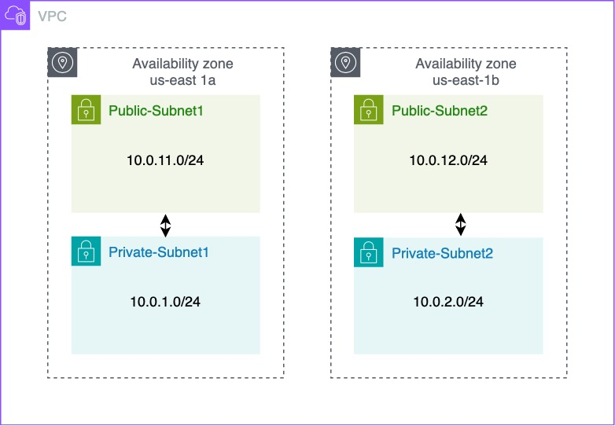

# AWS Networking Implementation (VPC, Subnets, Internet Gateway, NAT & Routing)

## What Is an Amazon VPC?
An Amazon Virtual Private Cloud (VPC) is like your own private section of the Amazon cloud where you can place and manage resources (i.e. servers or databases). You control incoming and outgoing traffic like a gated community.

### The Default VPC
The default VPC is like a starter pack provided by Amazon for your cloud resources. It is a pre-configured space in the Amazon cloud where you can immediately start deploying your applications or services. It has built-in-security and network settings to help you get up and running quickly but you can adjust these as you see fit.

A Default VPC which Amazon provides for you in each region (think of a region as a separate city) is like a pre-built house in that city. This house comes with some default settings to help you move in and start living (or start deploying your applications) immediately but just like a real house, you can change these settings according to your needs.

### Creating a new VPC
The following steps are taken to create a VPC:

* On the services search tab, type `VPC` to search for the VPC service.

* On your VPC dashboard, click on the `Create VPC` button.

* Use the following parameters when configuring the VPC and click on the `Create VPC` button:
1. Resource to create: VPC only
2. Name tag: first-vpc
3. IPv4 CIDR block: IPv4 CIDR manual input
4. IPv4 CIDR: 10.0.0.0/16
5. IPv6 CIDR block: No IPv6 CIDR block
6. Tenancy: Default

### Creating & Configuring Subnets
#### What are Subnets?
Subnets are like smaller segments within a VPC that help you organize and manage your resources. Subnets are like dividing an office building into smaller sections, where each section represents a department. In this analogy, subnets are created to organize and manage the network effectively.

| Subnet Name     | Availability Zone | CIDR Block   |
|-----------------|-------------------|--------------|
| Public-Subnet1  | us-east-1a        | 10.0.11.0/24 |
| Public-Subnet2  | us-east-1b        | 10.0.12.0/24 |
| Private-Subnet1 | us-east-1a        | 10.0.1.0/24  |
| Private-Subnet2 | us-east-1b        | 10.0.2.0/24  |

### Understanding Public & Private Subnets in AWS VPC
In the world of AWS VPC, think of subnets as individual plots in your land (VPC). Some of these plots (subnets) have direct road access (internet access), these are Public Subnets. Others are more private tucked away without direct road access, these are Private Subnets.

#### Creating a Public Subnet
The following steps are taken to create 2 Public Subnets:

* Click on the `Subnets` tab on the VPC dashboard.

* Click on the `Create subnet` button.

* Select the VPC (i.e. first-vpc) you created and clcik on the `Create subnet` button.

*  Use the following parameters when configuring the 1st Public Subnet:
1. Subnet Name: Public-Subnet1
2. Availability Zone: us-east-1a
3. IPv4 Subnet CIDR Block: 10.0.11.0/24

* Click on the `Add new subnet` button to create the 2nd Public Subnet.

* Use the following parameters when configuring the 2nd Public Subnet and click on `Create subnet` button:
1. Subnet Name: Public-Subnet2
2. Availability Zone: us-east-1b
3. IPv4 Subnet CIDR Block: 10.0.12.0/24

_The 2 Public Subnets created are shown above_

#### Creating a Private Subnet
The following steps are taken to create 2 Private Subnets:

* Click on the `Create subnet` button.

* Select the VPC (i.e. first-vpc) you created and click on the `Create subnet` button.

*  Use the following parameters when configuring the 1st Private Subnet:
1. Subnet Name: Private-Subnet1
2. Availability Zone: us-east-1a
3. IPv4 Subnet CIDR Block: 10.0.1.0/24

* Click on the `Add new subnet` button to create the 2nd Private Subnet.

*  Use the following parameters when configuring the 2nd Private Subnet and click on the `Create subnet` button:
1. Subnet Name: Private-Subnet2
2. Availability Zone: us-east-1b
3. IPv4 Subnet CIDR Block: 10.0.2.0/24

_The 2 Private Subnets created are shown above_

#### Working With Public & Private Subnets
Public Subnets are great for resources that need to connect to the internet like **web servers**. Private subnets are great for resources that you don't want to expose to the internet like **databases**.

Understanding public and private subnets helps you to organize and protect your AWS resources better. Always remember that public subnets are used for resources that need internet access and private subnets are for resources you want to keep private.

## Internet Gateway & Routing Table
#### Introduction to Internet Gateway & Table
In a real city, your virtual city (VPC) needs roads (Internet Gateway) for people (data) to come and go. You also need a map/GPS (Routing Table) to tell people (data) which way to go to reach their destination.

#### What is an Internet Gateway?
An Internet Gateway in AWS is like a road that connects your city (VPC) to the outside world (the internet). Without this road, people (data) can't come in or go out of your city.

To give your public subnet access to the main road (internet), you need an Internet Gateway. This acts like the entrance and exit to your property. 

#### Public Subnets
Technically, the subnets are still private. To make the subnets function as public subnets, the following steps must be taken:
* An Internet Gateway (IGW) attached to the VPC
* Route Table with a default route towards the IGW
* Public IP assigned to the AWS resources (i.e. EC2 Instances)

#### Creating an Internet Gateway
The following steps are taken to create an Internet Gateway:

* Go to your VPC dashboard and click on the `Internet Gateways` tab.

* Click on the `Create internet gateway` button.

* Name the internet gateway `test-igw` and click on `Create internet gateway`.

* Click on the `Action` button and click `Attach to VPC`.

* Select the `first-vpc` you created and click on the `Attach internet gateway` button.

## What is a Routing Table?
It is like a map/GPS. It tells the people (data) in your city (VPC) which way to go to reach their destination. For example, if the data wants to go to the internet, the Routing Table will tell it to take the road (Internet Gateway) that you built.

### Creating & Configuring Routing Tables
The following steps are taken to create and configure a routing table to direct resources in the Public Subnet to the Internet Gateway:

* Go to your VPC dashboard and click on `Route Tables`.

* Click on the `Create route table` button.

* Name the routing table `test-vpc-public-rtb`, select the `first-vpc` as your desired VPC and click on the `Create route table` button.

* Click on `Edit Routes`.

* Click on the `Add route` button, use the following parameters when adding a new route and click on the `save changes` button:
1. Destination: 0.0.0.0/0
2. Target: igw-<the_id_of_internet_gateway_you_created> (i.e. test-igw)

* Click on the `Subnet associations` tab and click on the `Edit subnet association` button.

* Select the 2 Public Subnets (i.e. Public-Subnet1 & Public-Subnet2) you created and click on the `save associations` button.

_Note: By linking the 2 Public Subnets (i.e. Public-Subnet1 & Punlic-Subnet2) to the Internet Gateway (test-igw), they function as **Public Subnets**. If they were not linked, they would continue to function as **Private Subnets**._

## NAT Gateway & Private Subnets
### Introduction to Private Subnets & NAT Gateway
In the AWS Virtual Private Cloud (VPC), private subnets are secluded areas where you can place resources that should not be exposed to the internet. But what if these resources need to access the internet for updates/downloads? This is where NAT Gateway comes in.

### Understanding NAT Gateway
A Network Address Translation (NAT) Gateway acts like a secure door that only opens one way. It allows your resources inside the private subnet to access the internet for things like updates and downloads but it doesn't allow anything from the internet to enter your private subnet.

It allows instances in your private subnet to connect to outside services like Databases but restricts external services from connecting to these instances.

### Creating a NAT Gateway & Linking it to a Private Subnet
The following steps are taken to create a NAT Gateway and link it to your Private Subnets using a Routing Table:

* Go to your VPC dashboard and click on the `Nat Gateways` tab.

* Click on the `Create NAT gateway` button.

* Use the following parameters when creating the NAT gateway then click on `Allocate Elastic IP` and `Create NAT gateway`:
1. Name: test-nat
2. Subnet: Public-Subnet1
3. Connectivity Type: Public

* Click on the `Route tables` tab.

* Name the routing table `test-vpc-private-rtb`, select the `first-vpc` as your desired VPC and click on the `Create route table` button.

* Click on `Edit Routes`.

* Click on the `Add route` button, use the following parameters when adding a new route and click on the `save changes` button:
1. Destination: 0.0.0.0/0
2. Target: nat-<the_id_of_NAT_gateway_you_created> (i.e. test-nat)

* Click on the `Subnet associations` tab and click on the `Edit subnet association` button.

* Select `Private-Subnet1` and click on the `save associations` button.

## Security Group & Network ACLs
### Understanding the Differences between Security Groups & Network Access Control Lists
Security groups and network access lists (ACLs) are both important tools for securing your network on the AWS cloud but they serve different purposes and have different use cases.

#### Security Groups

Security groups can be compared to a bouncer at a club who controls the flow of traffic to and from your resources in a cloud computing environment. Imagine you have a club, and you want to ensure that only authorized individuals can enter and exit. In this analogy, the club represents your cloud resources (such as virtual machines or instances), and the bouncer represents the security group.

Just like a bouncer checks the IDs and credentials of people at the club's entrance, a security group examines the IP addresses and ports of incoming and outgoing network traffic. It acts as a virtual firewall that filters traffic based on predefined rules. These rules specify which types of traffic are allowed or denied.

For example, a security group can be configured to allow incoming HTTP traffic (on port 80) to a web server, but block all other types of incoming traffic. Similarly, it can permit outgoing traffic from the web server to external databases on a specific port, while restricting all other outbound connections.

By enforcing these rules, security groups act as a line of defense, helping to protect your resources from unauthorized access and malicious attacks. They ensure that only the traffic that meets the defined criteria is allowed to reach your resources while blocking or rejecting any unauthorized or potentially harmful traffic.

It's important to note that security groups operate at the instance level, meaning they are associated with specific instances and can control traffic at a granular level. They can be customized and updated as needed to adapt to changing security requirements.

Overall, security groups provide an essential layer of security for your cloud resources by allowing you to define and manage access control policies, much like a bouncer regulates who can enter and exit a club.

#### Network Access Control (NACLs)

Network ACLs (Access Control Lists) can be likened to a security guard for a building, responsible for controlling inbound and outbound traffic at the subnet level in a cloud computing environment. Imagine you have a building with multiple rooms and entry points, and you want to ensure that only authorized individuals can enter and exit. In this analogy, the building represents your subnet, and the security guard represents the network ACL. 

Similar to a security guard who verifies IDs and credentials before allowing entry into the building, a network ACL examines the IP addresses and ports of incoming and outgoing network traffic. It serves as a virtual barrier or perimeter security, defining rules that dictate which types of traffic are permitted or denied.

For instance, a network ACL can be configured to allow incoming SSH (Secure Shell) traffic (on port 22) to a specific subnet while blocking all other types of incoming traffic. It can also permit outgoing traffic from the subnet to a specific range of IP addresses on a certain port while disallowing any other outbound connections.

By implementing these rules, network ACLs act as a crucial line of defense, safeguarding your entire subnet from unauthorized access and malicious attacks. They ensure that only traffic meeting the specified criteria is allowed to enter or exit the subnet while blocking or rejecting any unauthorized or potentially harmful traffic.

It's important to note that network ACLs operate at the subnet level, meaning they control traffic for all instances within a subnet. They provide a broader scope of security compared to security groups, which operate at the instance level. Network ACLs are typically stateless meaning that inbound and outbound traffic is evaluated separately, and specific rules must be defined for both directions.

In summary, network ACLs function as virtual security guards for your subnet regulating inbound and outbound traffic at a broader level. They operate similarly to a security guard who controls access to a building by examining IDs, ensuring that only traffic meeting the defined rules is allowed to pass and thereby providing protection against unauthorized access and malicious activities for your entire subnet.

#### In Conclusion

In short, security groups and network ACLs are both important tools for securing your network on the AWS cloud but they serve different purposes and have different use cases. Security groups are like a bouncer at a club controlling inbound and outbound traffic to and from your resources at the individual resource level. Network ACLs on the other hand are like a security guard for a building controlling inbound and outbound traffic at the subnet level.

## VPC Peering & VPN Connection
### Introduction to VPC Peering
VPC Peering is a networking feature that allows you to connect 2 Virtual Private Clouds (VPCs) within the same cloud provider's network or across different regions. VPC Peering enables direct communication between VPCs allowing resources in each VPC to interact with each other as if they were on the same network. It provides a secure and private connection without the need for internet access. VPC Peering is commonly used to establish connectivity between VPCs in scenarios such as multi-tier applications, resource sharing or data replication.

### Benefits of VPC Peering
* **Simplified Network Architecture**: VPC Peering simplifies network design by enabling direct communication between VPCs eliminating the need for complex networking configurations.

* **Enhanced resource Sharing**: With VPC Peering, resources in different VPCs can communicate seamlessly allowing for the efficient sharing of data, services and applications.

* **Increased Security**: Communication between peered VPCs remains within the cloud provider's network ensuring a secure and private connection.

* **Low Latency and High Bandwidth**: VPC Peering enables high-performance networking with low latency and high bandwidth improving application performance.

* **Cost Efficiency**: Utilizing VPC Peering eliminated the need for additional networking components reducing costs associated with data transfer and network infrastructure.

### Introduction to VPN Connections
Virtual Private Network (VPN) connections establish a secure and encrypted communication channel between your on-premises network and a cloud provider's network such as a VPC. VPN connections enable secure access to resources in the cloud from remote locations or connect on-premises networks with cloud resources.

There are two primary types of VPN connections which are:

1. **Site-to-Site VPN**: It establishes a secure connection between your on-premises network and the cloud provider's network. It allows communication between your on-premises resources and resources in the VPC securely and privately. This type of VPN connection is commonly used in Hybrid Cloud Architectures.

2. **AWS Client VPN**: AWS Client VPN provides secure remote access to the cloud network for individual users or devices. It enables secure connectivity for remote employees, partners or contractors to access resources in the VPC securely.

### Benefits of VPN Connections
* **Secure Remote Access**: VPN connections enable secure access to resources in the cloud network for remote users or devices ensuring data privacy and protection.

* **Data Encryption**: VPN connections encrypt the data transmitted between your on-premises network and the cloud network providing a secure channel for data transfer.

* **Flexibility and Mobility**: VPN connections allow authorized users to securely access cloud resources from any location promoting flexibility and mobility in accessing critical applications and data.

* **Hybrid Cloud Connectivity**: VPN connections play a vital role in establishing secure and reliable connectivity between your on-premises network and cloud resources facilitating hybrid cloud architectures and seamless integration.

#### Summary
VPC Peering enables direct communication between VPCs simplifying network architecture and enhancing resource sharing within the cloud network. VPN connections establish secure tunnels between on-premises networks and the cloud enabling secure remote access and facilitating hybrid connectivity. Both VPC Peering and VPN connections contribute to building secure, scalable and efficient network infrastructures in cloud environments.