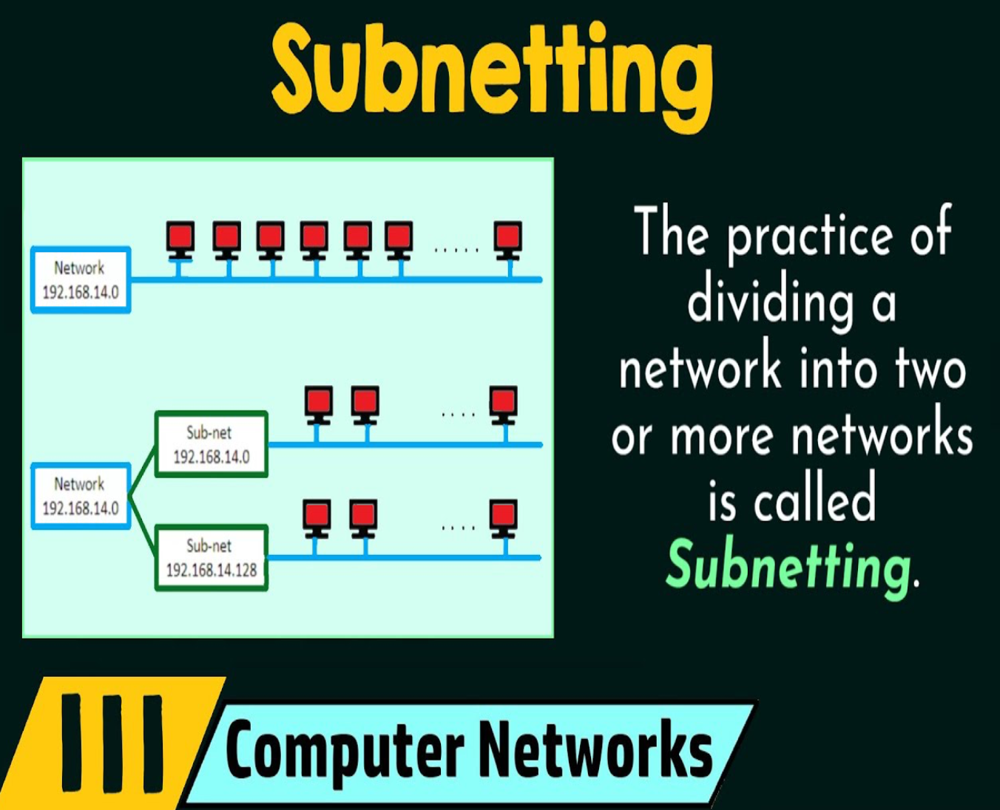

# Understanding IP Addresses & CIDR Notation
## Introduction to IP Addresses
An IP address is a unique address that identifies a device on the Internet or a local network, IP stands for "Internet Protocol" which is the set of rules governing the format of data sent via the Internet or local network. In essence, IP addresses are the identifier that allows information to be sent between devices on a network.

They contain location information and make devices accessible for communication. The internet needs a way to differentiate between different computers, websites and routers. IP addresses provide a way of doing so and form an essential part of how the Internet works.

### What is an IP Address?
An IP address is a string of numbers separated by periods. IP addresses are expressed as a set of four numbers (i.e. 192.158.1.38). Each number in the set can range from 0 to 255. The full IP addressing range goes from 0.0.0.0 to 255.255.255.255. IP addresses are not random. 

They are mathematically produced and allocated by the Internet Assigned Numbers Authority (IANA), a division of the Internet Corporation for Assigned Names and Numbers (ICANN).

ICANN is a non-profit organization that was established in the United States in 1998 to help maintain the security of the internet and allow it to be usable by all. Each time anyone registers a domain on the internet, they go through a domain name registrar, who pays a small fee to ICANN to register the domain.

## Subnetting & Subnet Masks
### What is Subnetting?
Subnetting is the practice of dividing a network into two or smaller networks. It increases routing efficiency which helps to enhance the security of the network and reduces the size of the broadcast domain.
IP Subnetting designates high-order bits from the host as part of the network prefix. 

This method divides a network into smaller subnets. It also helps to reduce the size of the routing tables, which are stored in routers. This method also helps in extending the existing IP address base & restructures the IP address.

### What is a Subnet Mask? 
A subnet mask is a 32-bit address used to distinguish between a Network Address and a Host Address in an IP address. A subnet mask identifies which part of an IP address is the Network Address and the Host Address. They are not shown inside the data packets traversing the Internet. They carry the destination IP address, which a router will match with a subnet.

## CIDR Notation & Address Aggregation
### What is CIDR?
Classless Inter-Domain Routing (CIDR) is an IP address allocation method that improves data routing efficiency on the internet. Every machine, server and end-user device that connects to the internet has a unique number called an IP address associated with it.

Devices find and communicate with one another using these IP addresses. Organizations use CIDR to allocate IP addresses flexibly and efficiently in their networks.

### IP Address Aggregator
IP Address Aggregator is a utility developed to automate the minimization process and convert a bunch of IPv4 addresses into the smallest continuous range(s) possible. 

IP aggregation is commonly performed by network engineers working with BGP & routers. This utility will help webmasters to configure server firewalls, apache .htaccess files, address masks and so on.

## IP Address Classes & Private IP Address Ranges
### What is Classful Addressing?
Classful addressing is a network addressing the Internet's architecture from 1981 till Classless Inter-Domain Routing was introduced in 1993. This addressing method divides the IP address into five separate classes based on four address bits.

Here, classes A, B and C offer addresses for networks of three distinct network sizes. Class D is only used for multicast and class E is reserved exclusively for experimental purposes.

Let's see each of the network classes in detail:

### Class A Network
This IP address class is used when there are a large number of hosts. In a Class A network, the first 8 bits (i.e. first octet) identify the network and the remaining 24 bits identify the host in that network. 

An example of a Class A address is 102.168.212.226. Here, "102" helps you identify the network and 168.212.226 identifies the host. Class A addresses 127.0.0.0 to 127.255.255.255 cannot be used and is reserved for Loopback and Diagnostic Functions.

### Class B Network
In a Class B, the binary addresses start with 10. In this IP address, the class decimal number can be between 128 to 191. The number 127 is reserved for loopback which is used for internal testing on the local machine. The first 16 bits (i.e. two octets) identify the network while the remaining 16 bits indicate the host within the network. 

An example of a Class B IP address is 168.212.226.204, where 168.212 identifies the network while 226.204 identifies the network host.

### Class C Network
Class C is a type of IP address that is used for a small network. In this class, three octets are used to indicate the network. This IP ranges between 192 to 223. In this type of network addressing method, the first two bits are set to "1" and the third bit is set to "0" which makes the first 24 bits of the address them and the remaining bit the host address. 

Mostly local area networks use Class C IP addresses to connect with the network. 
An example of a Class C IP address is 192.168.178.1.

### Class D Network
Class D addresses are only used for multicasting applications. Class D is never used for regular networking operations. This class addresses the first three bits set to "1" and their fourth bit set to use for "O". Class D addresses are 32-bit network addresses. All the values within the range are used to identify multicast groups uniquely.

Therefore, there is no requirement to extract the host address from the IP address, so Class D does not have any subnet mask. An example of a Class D IP address is 227.21.6.173.

### Class E Network
Class E IP address is defined by including the starting four network address bits as 1, which allows you two to incorporate addresses from 240.0.0.0 to 255.255.255.255. However, the E class is reserved and its usage is never defined. 

Therefore, many network implementations discard these addresses as undefined or illegal. An example of a Class E IP address is 243.164.89.28.

### Limitations of Classful IP Addressing
Here are the drawbacks/cons of the classful IP addressing method:
1. Risk of running out of address space soon Class boundaries did not encourage efficient allocation of address space. 
2. Rules for assigning Network ID: The network ID will be assigned based on the below-given rules:
* The network ID cannot start with 127 because 127 belongs to a class A address and is reserved for internal loopback functions.  
* All bits of network ID set to 1 are reserved for use as an IP broadcast address and cannot be used.  
* All bits of network ID are set to 0. They are used to denote a particular host on the local network and should not be routed.

### Advanced Topics in IP Addressing
Advanced topics in TCP/IP networking involve the study of advanced technologies and techniques for managing and optimizing network performance. These may include routing protocols which are used to exchange information about network destinations between devices on a network:

**Virtual Private Networks (VPNs)** which enable users to securely connect to a private network over the internet.

**Quality of Service (QoS)** is a set of technologies and techniques that are used to manage and optimize network performance.

**Domain Name System (DNS)** is a hierarchical, distributed database that is used to translate human-readable domain names into machine-readable IP addresses.

**Network Address Translation (NAT)** is a technique that is used to allow devices on a private network to communicate with devices on a public network.

By understanding these and other advanced topics in TCP/IP networking, organizations can effectively design, manage and optimize their networks.

Routing protocols exchange information about network destinations between devices on a network. They are an important component of advanced TCP/IP networking topics as they play a key role in determining the best path for data to travel from one device to another.

There are several types of routing protocols including:

**Distance Vector Routing Protocols**: These protocols use a distance metric (i.e. hop count) to determine the best path to a destination. Examples include Routing Information Protocol (RIP) and Interior Gateway Routing Protocol (IGRP).

**Link-State Routing Protocols**: These protocols maintain a database of the entire network topology and use this information to determine the best path to a destination. Examples include Open Shortest Path First (OSPF) and Intermediate System-to-Intermediate System (IS-IS).

**Hybrid Routing Protocols**: These protocols combine elements of distance vector and link-state protocols. Examples include Enhanced IGRP (EIGRP) and Border Gateway Protocol (BGP).

**Path Vector Routing Protocols**: These protocols use a path vector (a list of autonomous systems that a route traverses) to determine the best path to a destination. Examples include Border Gateway Protocol (BGP) and Protocol Independent Multicast (PIM).

By understanding the different routing protocols and how they work, you can more effectively design and manage networks, optimize routing decisions and improve network performance.

### Quality of Service (QOS)
It is a set of technologies and techniques used to manage and optimize network performance. It is often discussed in the context of advanced TCP/IP networking topics to ensure that critical applications and services receive the bandwidth and resources they need to operate effectively.

There are several key components of QoS including:

**Traffic management**: This involves rate limiting and congestion control techniques to ensure that network resources are used efficiently and fairly.

**Priority queuing**: This involves assigning different priorities to different types of traffic so that important traffic (such as real-time audio and video) is given priority over less critical traffic (such as email and file transfers).

**Packet Marking**: This involves adding tags or markings to packets to indicate their priority level so that network devices can treat them differently.

**Packet Scheduling**: This involves selecting which packets to transmit first based on their priority level and other factors.

By implementing QoS technologies and techniques, organizations can improve the performance and reliability of their networks and ensure that critical applications and services receive the resources they need to operate effectively.

### Domain Name System (DNS)
The Domain Name System (DNS) is a hierarchical, distributed database that is used to translate human-readable domain names (i.e. www.example.com) into machine-readable IP addresses (i.e. 192.168.1.1). 

It is often discussed in the context of advanced TCP/IP networking topics as a critical component of the internet's infrastructure.

There are several key components of DNS including:

**Domain Names**: These are the human-readable names used to identify websites and other resources on the internet.

**DNS Servers**: These are the servers that store and manage the DNS database and respond to DNS queries from clients. DNS records are the entries in the DNS database that map domain names to IP addresses and other information.

**DNS Protocols**: These are the protocols that are used to communicate between DNS servers and clients.

By understanding how DNS works, organizations can more effectively manage their online presence, optimize their use of DNS resources, and improve the performance and reliability of their networks.

### Network Address Translation (NAT)
Network Address Translation (NAT) is a technique that allows devices on a private network to communicate with devices on a public network such as the Internet. It is often used to allow devices on a local network to access the internet without needing a public IP address.

There are several benefits to using NAT, including:

**Security**: NAT can help to improve security by hiding the IP addresses of devices on the private network from the public network. This can make it more difficult for attackers to target specific devices.

**Resource Conservation**: NAT can help conserve resources by allowing multiple devices on a private network to share a single public IP address. This can be useful when a limited number of public IP addresses are available.

**Improved Performance**: NAT can help improve a network's performance by reducing the number of IP addresses that need to be routed over the internet. This can reduce the load on the network and improve overall performance.

NAT is a useful technique for allowing devices on a private network to communicate with devices on a public network while maintaining security and conserving resources.