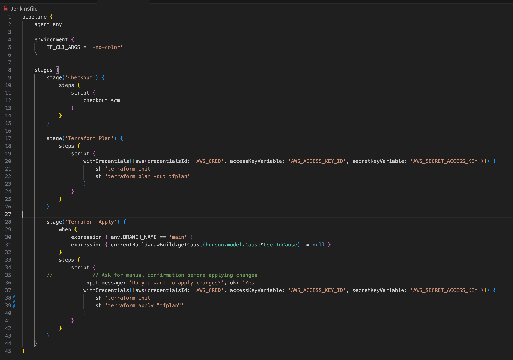

# Implementing CICD Pipeline for Terraform using Jenkins

## Prerequisites
* Download [docker](https://www.docker.com/products/docker-desktop/) on your computer and ensure you download the right Docker release that is compatible with the OS of your computer.

* Ensure your IAM user has the following permissions: **AdministratorAccess** & **IAMFullAccess**

## How to Implement CICD Pipeline for Terraform using Jenkins
The following steps are taken to implement a CICD pipeline for Terraform using Jenkins:

### Step 1: Setting Up The Environment
Jenkins comes with a docker image that can be used out of the box to run a container with all the relevant dependencies for Jenkins but because we have a unique requirement to run terraform, we need to find a way to extend the readily available jenkins image. To achieve this, we must write a `dockerfile` and include the necessary dependencies to implement this project as shown below:

1. Create a directory and name it `terraform-with-cicd`

```sh
mkdir terraform-with-cicd && cd terraform-with-cicd
```


2. Create a file and name it `Dockerfile`

```sh
vi Dockerfile
```

3. Copy and paste the content into the `Dockerfile` then save and exit the file.

```sh
 # Use the official Jenkins base image
 FROM jenkins/jenkins:lts

 # Switch to the root user to install additional packages
 USER root

 # Install necessary tools and dependencies (e.g., Git, unzip, wget, software-properties-common)
 RUN apt-get update && apt-get install -y \
     git \
     unzip \
     wget \
     software-properties-common \
     && rm -rf /var/lib/apt/lists/*

 # Install Terraform
 RUN apt-get update && apt-get install -y gnupg software-properties-common wget \
     && wget -O- https://apt.releases.hashicorp.com/gpg | gpg --dearmor | tee /usr/share/keyrings/hashicorp-archive-keyring.gpg \
     && gpg --no-default-keyring --keyring /usr/share/keyrings/hashicorp-archive-keyring.gpg --fingerprint \
     && echo "deb [signed-by=/usr/share/keyrings/hashicorp-archive-keyring.gpg] https://apt.releases.hashicorp.com $(lsb_release -cs) main" | tee /etc/apt/sources.list.d/hashicorp.list \
     && apt-get update && apt-get install -y terraform \
     && rm -rf /var/lib/apt/lists/*

 # Set the working directory
 WORKDIR /app

 # Print Terraform version to verify installation
 RUN terraform --version

 # Switch back to the Jenkins user
 USER jenkins
```


#### Explaining the Dockerfile
1. `FROM jenkins/jenkins:lts`: This line specifies the base image for the Dockerfile. In this case, it's using the official Jenkins LTS (Long Term Support) image as a starting point.

2. `USER root`: This command switches to the root user within the Docker image. This is done to perform actions that require elevated permissions such as installing packages.

3. Install necessary tools and dependencies (i.e. Git, unzip, wget, software-properties-common). The `apt-get update` command refreshes the package list and `apt get install` installs the specifies packages `(i.e. git, unzip, wget, software-properties-common)`. The `&&` is used to chain commands and `rm -rf /var/lib/apt/lists/*` removes unnecessary package lists helping to reduce the size of the Docker image.
```sh
RUN apt-get update && apt-get install -y \
    git \
    unzip \
    wget \
    software-properties-common \
    && rm -rf /var/lib/apt/lists/*
```
 4. Install Terraform and its dependencies. 
 ```sh
 RUN apt-get update && apt-get install -y gnupg software-properties-common wget \
    && wget -O- https://apt.releases.hashicorp.com/gpg | gpg --dearmor | tee /usr/share/keyrings/hashicorp-archive-keyring.gpg \
    && gpg --no-default-keyring --keyring /usr/share/keyrings/hashicorp-archive-keyring.gpg --fingerprint \
    && echo "deb [signed-by=/usr/share/keyrings/hashicorp-archive-keyring.gpg] https://apt.releases.hashicorp.com $(lsb_release -cs) main" | tee /etc/apt/sources.list.d/hashicorp.list \
    && apt-get update && apt-get install -y terraform \
    && rm -rf /var/lib/apt/lists/*
 ```

 * `wget -O- https://apt.releases.hashicorp.com/gpg | gpg --dearmor | tee /usr/share/keyrings/hashicorp-archive-keyring.gpg`: This command downloads HashiCorp's GPG key from `https://apt.releases.hashicorp.com/gpg` while `gpg --dearmor` converts the key into a format that can be easily used by tools and `tee /usr/share/keyrings/hashicorp-archive-keyring.gpg` writes the key to the specified file with `.gpg` extension.

 * `gpg --no-default-keyring --keyring /usr/share/keyrings/hashicorp-archive-keyring.gpg --fingerprint`: This command displays the fingerprint of the GPG key. The fingerprint is a unique identifier for the key and is used to verify its authenticity.

 * `echo "deb [signed-by=/usr/share/keyrings/hashicorp-archive-keyring.gpg] https://apt.releases.hashicorp.com $(lsb_release -cs) main" | tee /etc/apt/sources.list.d/hashicorp.list`: This commands adds HashiCorp's repository configuration to the system's package manager (apt in this case) and it specifies the GPG key to be used for package verification.

 * `RUN apt-get update && apt-get install -y terraform && rm -rf /var/lib/apt/lists/*`: These commands update the package list, installs Terraform and then removes unnecessary packages to reduce the size of the Docker image.

 5. `WORKDIR /app`: This line sets the working directory for subsequent commands to `/app`. This is where you'll be when you enter the container.

 6. `RUN terraform --version`: This command prints the version of Terraform to the console, allowing you to verify that the installation was successful.

 7. `USER jenkins`: This line switches back to the jenkins user returning to a lower privilege level. This is a good security practice to minimize the risk of running processes as the root user within the container.

 ### Step 2: Building and Running the Docker Image
 Make sure that you are inside the folder containing the `Dockerfile`. This is generally referred to as the `Docker Build Context`, the build context is the set of files located in the specified directory or path when you build a Docker image using the `docker build command`. The content of the build context is sent to the Docker daemon during the build process and it serves as the source for building the Docker image as shown below:

 1. Run the command below to build the custom jenkins image. Notice the `.` at the end of the command, it is the `docker build context` meaning the current directory where the Dockerfile is.

 ```sh
  docker build -t jenkins-server .
 ```

 

 2. Run the image into a docker using the command below:

 ```sh
 docker run -d -p 8080:8080 --name jenkins-server jenkins-server 
 ```

 This should output a hash data as shown below:

`800f8f48466b3419d7cbf37908b12f146120b31260147bdd3b433d23e60f976b`


Let's break down the `docker run` command for a clear understanding:

* `docker run`: This command is used to runa Docker container.

* `-d`:This flag stands for "detach". It runs the container in the background allowing you to continue using the terminal for other commands.

* `-p 8080:8080`: This flag maps the `8080` from the host to the port `8080` inside the container. It means that you can access the application running inside the container on your host machine's port **8080**. Simply go to the browser and put in there `localhost:8080` to display the application.

* `--name jenkins-server`: This flag assigns a name to the container. In this case, the name is set to `jenkins-server`.

* `jenkins-server`: This is the name of the Docker image that you want to run. It refers to the image named `jenkins-server` that was built earlier when we ran the `docker build` command.

3. Run the `docker ps` command to check that the container is running and copy the **Container ID**.


4. Access the Jenkins Server directly inside the container from your terminal using the command shown below:

```sh
docker exec -it  <container_id>  /bin/bash
```


```sh
pwd
```


Let's break down the command:
* `docker exec`: This command is used to execute a command in a running Docker container.

* `-it`: These flags are often used together. The `-i` flag stands for interactive (i.e. allows you to interact with the container) and the `-t` flag allocates psedudo-TTY enabling a more interactive session.

* `container_id`: It uniquely identifies the running container. In thus case, replace it with the actual ID or name of your container. You can get this from the out put of the `docker ps` command.

* `/bin/bash`: This command is used execute commadns inside the container. In this case, it's launching an interactive Bash shell within the specified container.

So when you run this command, Docker will do the following:
* Use the `exec` command to execute a command in a running container.
* Use the `-it` flag to make the interaction with the container interactive.
* Specify the Container ID or Name.
* Specify the command to execute inside the container which is `/bin/bash`.

You will also notice that once you get into the container, the directory you get to find yourself is the `/app` which is from the `WORKDIR` directive inside the `Dockerfile`.

5. Retrieve the initial Jenkins admin password using the command shown below:

```sh
cat /var/jenkins_home/secrets/initialAdminPassword
```


6. Access the Jenkins server from your web browser on `localhost:8080` and paste the `initialAdminPassword`


7. Install the suggested plugins.


8. Create your admin user and access Jenkins.


### Step 3: Install GitHub, AWS Credentials and Terraform plugins on Jenkins

In order to implement a CICD pipeline for Terraform using Jenkins, the following plugins: **GitHub Integration**, **AWS Credentials** and **Terraform** plugins need to be installed on Jenkins to communicate with the GitHub repository that has the configuration files for this project and to interact AWS services using the Access Keys and ID during the execution of tasks and deployment.

The following steps are taken to install these plugins:

* Click on the `Manage Jenkins` and `Plugins` tab.


* Click on the `Available Plugins`, Search and select the following plugins: **GitHub Integration**, **Terraform** and **AWS Credentials** then click on `Install`.


* If everything is successful then click `restart jenkins`. _**Note**: You may need to refresh your browser if the restart takes a long time. If this happens, your docker container may exit and Jenkins will no longer load on your browser._


* Go to your terminal and run the follwing command to check the status of the container:

```sh
docker ps -a
```


* Restart the container using the command shown below:

```sh
docker restart <container_id>
```


* Then go back to the brower and log into Jenkins with your admin credentials to access Jenkins.


* Navigate to the **Installed plugins** section, use the search bar to search for the plugins you installed (i.e. **GitHub Integration**, **AWS Credentials** and **Terraform**) and you should see the newly installed plugins.


### Step 4: Configure GitHub and AWS Credentials on Jenkins

* Go to your GitHub account on your browser, click on the profile icon and click `settings`.


* Click on `Developer settings`.


* Click on `Personal access tokens` and click on `Tokens (classic)`.


* Click on `Generate new token` and `Generate new token (classic)`.


* Input your password.


* Type `terraform_cicd` as the note, select all the scopes and click on `Generate token`.


* Copy the token generated.


* Log into Jenkins.

```sh
http://localhost:8080
```

* Click on `Manage Jenkins` and click on `Credentials`.


* Click on the arrow beside `global` and select `Add credentials`.


* Select **Username with password** as `kind`, input your **GitHub account email address** as the `username`, paste the **GitHub token** as the `password`, name the `ID` **Github-access** and click on `Create`.


* Click on the arrow beside `global` and select `Add credentials` on the stores scoped to Jenkins tab.


* Select **AWS Credentials** as the `kind`, input **AWS_CRED** as the `ID` and paste the paste the **Access Key ID** and **Secret Access Key** generated by your IAM user on AWS console and click on `Create`. **Note**: If you need a reminder on how to create IAM user Access and Secret Key in AWS cosole, [click here](https://www.youtube.com/watch?v=HuE-QhrmE1c&feature=youtu.be).


### Step 5: Set up a Git repository with Terraform code

* Fork the https://github.com/dareyio/terraform-aws-pipeline.git repository into your own GitHub account. _**Note**: This repository contains configuration files that provisions Kubernetes Cluster using EKS and creates AWS Networking Infrastructure_.

* Create a repo called `terraform-aws-pipeline` on your GitHub account.


* Open terminal on your PC, create a folder called `terraform-aws-pipeline` and enter the directory using the command shown below:

```sh
mkdir terraform-aws-pipeline
cd terraform-aws-pipeline
```


* Run the following the commands to fork the repository into the GitHub repository you created:

```sh
git init
git pull https://github.com/dareyio/terraform-aws-pipeline.git
git remote add origin https://github.com/<github_username>/terraform-aws-pipeline.git
git branch -M main
git push -u origin main
```


* The `provider.tf` file has an S3 backend configuration used to store the Terraform state file.

* Go to your terminal and create your own bucket using the command shown below:

```sh
aws s3api create-bucket --bucket <bucket_name> --region <aws_region>
```


_**Note**: Ensure you have **AWS CLI** installed on your PC and have configured it to with the **Access Key ID** and **Secret Access Key** using the `aws configure` command_.

* Update the bucket name and on the backend configuration of the `provider.tf` file.


* Push the latest changes to GitHub using the following command:

```sh
git add provider.tf && git commit -m "updates" && git push
```


#### Let us talk about the Jenkinsfile in the GitHub repository

The `Jenkinsfile` pipeline automates the process of code checkout, planning infrastructure changes with Terraform and conditionally applying those changes. It is designed to ensure that changes to infrastructure managed by Teraform are reviewed and applied systemically before applying changes to critical environments like production.



#### Pipeline
`pipeline { ... }`: This is the wrapper for the entire pipeline script. Everything that defines what the pipeline does is included within these braces.

#### Agent
`agent any`: This line specifies that the pipeline can run on any available agent. In Jenkins, an agent is a worker that executes the job. **Any** means it doesn't require a specific agent configuration.

#### Environment
`environment { ... }`: This section is used to define environment variables that are applicable to all stafes of the pipeline.

`TF_CLI_ARG = 'no-color'`: This sets an environment variable for Terraform. It tells Terraform to not colorize its output which can be useful for logging and readability in CICD environments. 

#### Stages
`stages { ... }`: This block defines the various stages of the pipeline. Each stage is a step in the pipeline process.

##### Stage: Checkout
`stage('Checkout') { ... }`: This is the first stage and it is typically used to checkout the source code from a version control system.

`checkout scm`: This checks out source code from the Source Control Management (SCM) sytem configured for the job (i.e. Git).

##### Stage: Plan
`stage('Terraform Plan') { ... }`: This stage is responsible for running a Terraform plan.

`withCredentials([aws(...)]) { ... }`: This block securely injects AWS credentials into the environment.

`sh 'terraform init'`: This intializes Terraform in the current directory.

`sh 'terraform plan -out=tfplan'`: This runs Terraform plan and outputs the plan to a file named 'tfplan'.

##### Stage: Teraform Apply

`stage('Terraform Apply') { ... }`: This stage applies the changes from Terraform plan to make infrastructure chnages.

`when { ... }`: This block sets conditions for executing this stage and the `expression { env.BRANCH_NAME == 'main' }` condition checks if the pipeline is running on the `main` branch.

`expression { ... }`: This checks if the build was triggered by a user action.

`input message: 'Do you want to apply changes?' , ok: 'Yes'`: A manual intervention step asking for confirmation before proceeding. If `yes` is clicked, it runs the `teraform init & apply` command otherwise, the pipeline is aborted.

### Step 6: Set up a Jenkins Multibranch Pipeline for Terraform CICD

* On the Jenkins dashboard, click on `New Item`.


* Name the item `terraform_cicd`, select `Multibranch Pipeline` and click `ok`.


* Type **terraform_cicd** as the `display name` and `description`.

* On the **Branch Sources** tab, click on `Add source` and `Git`, select the **credentials** to be used to connect to GitHub from Jenkins and paste the **repository url** you forked from https://github.com/dareyio/terraform-aws-pipeline.git.

* Leave everything at default, click on `Apply` and hit `Save`.


* You will immediately see the scanning of the repository for branches and the **Jenkinsfile**.


* Click on the build number.


* Move your cursor to the **Terraform Plan** stage and click on `logs` to view the command line output.


* The **Terraform Apply** stage failed, click on the failed console output icon and scroll down to view the error message.


* To fix the `Scripts not permitted to use method`, go to the Jenkins Dashboard, click on `Manage Jenkins`, scroll down to the `Security Tab` and click on `In-Process Script Approval`.


* Click on `Approve`.


* Go back to your `terraform_cicd` multibranch pipeline and initiate another build.


* The build failed again, check on the console output icon to view the error message.


* To fix the `Scipts not permitted to use method hudson.model` error, go to the Jenkins Dashboard, click on `Manage Jenkins`, scroll down to the `Security Tab` and click on `In-Process Script Approval`.


* Click on `Approve`.


* Go back to your `terraform-cicd` multibranch pipeline, initiate another build and move your cursor to the `Terraform Apply `stage and click on `Yes` to apply changes.


* The `terraform-cicd` multibranch pipeline build is successful.

