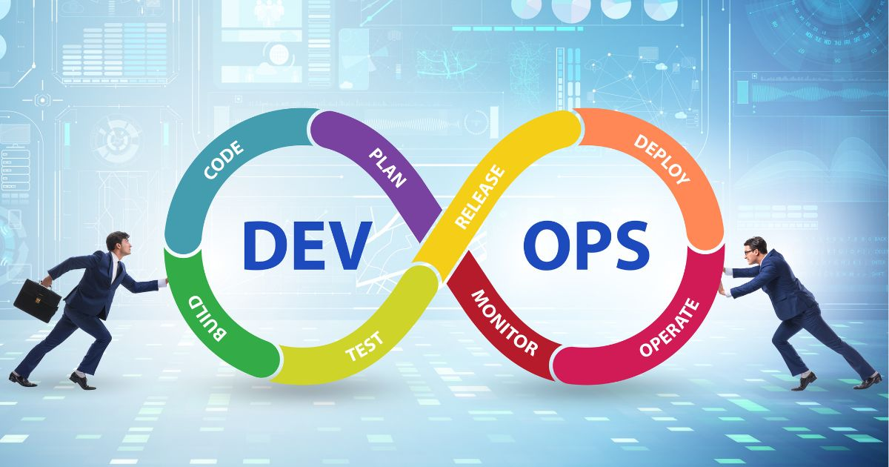

# DevOps Projects
Welcome to the official documentation of the DevOps project. This repository contains all the information and resources required to set up various DevOps architecture from beginner to advanced. 

The goal of these projects is to give hands-on insights the process of building, testing, and deploying software applications to production, thus reducing the time and effort required for manual intervention.

## Tools Used
* Jenkins
* Git
* Nginx
* MySQL
* Docker
* Kubernetes
* Ansible
* Terraform
* Apache

## Prerequisites
Before you start, make sure you have the an account on any of the following Cloud Providers:
* AWS
* Digital Ocean
* Azure
* GCP

## List of the Projects
[1. LInux Practice Projects](./01-Linux-Practice-Project)

[2. Shell Scripting](./02-Shell-Scripting/)

[3. LAMP Stack Implementation](./03-LAMP-Stack-Implementation-In-AWS/)

[4. LEMP Stack Implementation](./04-LEMP-Stack-Implementation-On-AWS/)

[5. Client-Server Architecture using MySQL](./05-Client-Server-Architecture-using-MySQL-DBMS/)

[6. Implementing Load Balancing with Nginx](./06-Implementing-Load-Balancing-with-Nginx/)

[7. Automating Load Balancer Configuration with Shell Scripting](./07-Automating-Load-Balancer-Configuration-with-Shell-Scripting/)

[8. DevOps Tooling Website Solution](./08-DevOps-Tooling-Website-Solution/)

[9. Implementing Wordpress Website with LVM Storage Management](./09-Implementing-Wordpress-Website-with-LVM-Storage-Management/)

[10. Ansible Automation Project](./10-Ansible-Automation-Project/)

[11. Ansible Refactoring Assignments & Imports](./11-Ansible-Refactoring-Assignments-and-Imports/)

[12. Ansible Dynamic Assignments & Community Roles](./12-Ansible-Dynamic-Assignments-and-Community-Roles/)

[13. Understanding IP Addresses & CIDR Notation](./13-Understanding-IP-Addresses-and-CIDR-Notation/)

[14. AWS Networking Implementation (VPC, Subnets, Internet Gateway, NAT & Routing)](./14-AWS%20Networking%20Implementation%20(VPC,%20Subnets,%20Internet%20Gateway,%20NAT%20&%20Routing)/)

[15. Automating AWS with IaC using Terraform](./15-Automating-AWS-Infrastructure-with-IaC-using-Terraform/)

[16. Implementing CICD Pipeline for Terraform using Jenkins](./16-Implementing-CICD-Pipeline-for-Terraform-using-Jenkins/)

[17. Monitoring Infrastructure in AWS](./17-Monitoring-Infrastructure-in-AWS/)

[18. Migration to the Сloud with Containerization](./18-Migration-to-the-Сloud-with-Containerization/)

[19. Deploying Applications Into Kubernetes Cluster](./19-Deploying-Applications-Into-Kubernetes-Cluster/)

[20. Deploying Prometheus, Grafana and Loki into a Kubernetes Cluster](./20-Deploying%20Prometheus-Grafana-and-Loki-in%20a-Kubernetes-Cluster/)